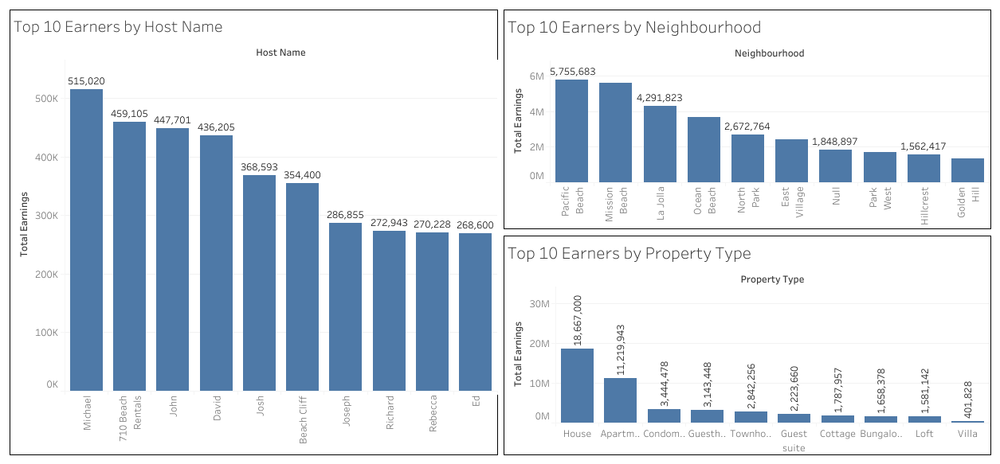
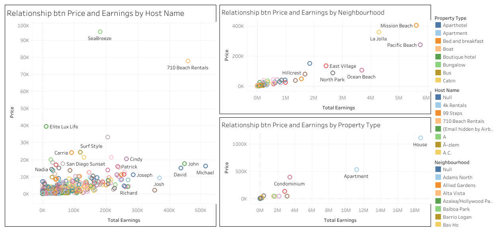
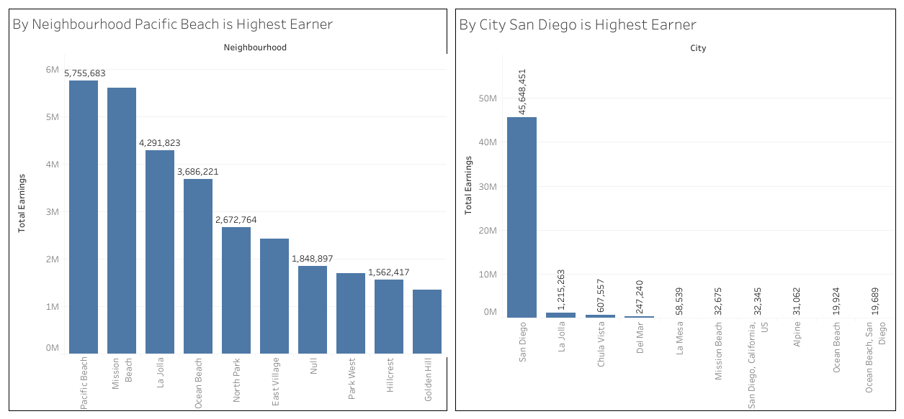
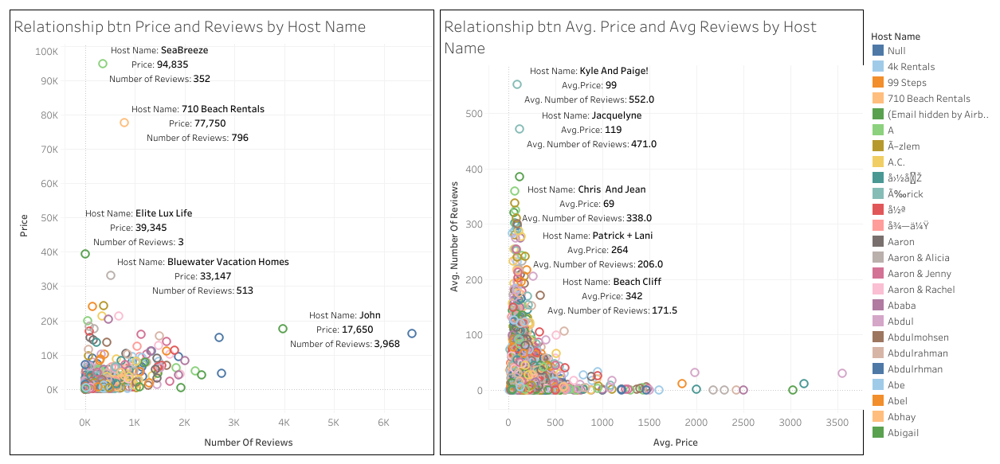

# 🏨 Staycatin Listing Revenue Analysis

This project analyzes listing data from Staycatin.com, a fictional rental platform, to uncover insights about earnings, pricing, reviews, and location-based performance. The findings are presented through an interactive Tableau dashboard and story.

---

## 📊 Objective

To help business stakeholders understand:
- Which listings generate the highest revenue
- How price affects earnings
- Which locations perform best
- How reviews correlate with pricing

---

## 🧠 Key Questions Answered

1. 💰 Who are the **Top 10 highest earning hosts**?
2. 📈 Is there a **relationship between listing price and earnings**?
3. 📍 Which **locations/shore sides** perform better in terms of total revenue?
4. 📝 Is there a **relationship between reviews and pricing**?

---

## 📁 Folder Structure

Staycatin-Listing-Revenue-Analysis/
├── data/ ← Raw data (.xlsx)
├── output/ ← Tableau PDF exports (dashboard, story, link)
├── images/ ← Screenshots of each dashboard
└── README.md ← Project overview (this file)

---

## 🧰 Tools Used

- **Tableau Public**
- Microsoft Excel (data prep)
- Canva (optional) for presentation

---

## 📸 Dashboard Preview

| Dashboard Panel | Preview |
|------------------|---------|
| Top 10 Earners   |  |
| Price vs Earnings |  |
| Highest Earning Location |  |
| Price vs Reviews by Host |  |

---

## 🌐 Live Tableau Dashboard

## 🌐 Live Tableau Dashboard

📎 [View it on Tableau Public](https://public.tableau.com/views/ProjectDashboard1_17500805078090/ProjectDBALL?:language=en-GB&:sid=&:redirect=auth&:display_count=n&:origin=viz_share_link)

---

## 👨‍💻 Author

**Tarun Kumar Malviya**  
Data Analyst | Tableau | Excel | Business Intelligence  
📧 tarunmalviya804@gmail.com

---

## ✅ Project Status

- ✅ Completed: Tableau Dashboard + Story + Exports
- 🟡 Optional: Extend with Power BI or geospatial map
